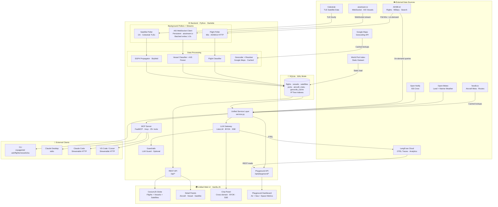

# 🚀 VoyageIntel

**Unified real-time air, sea, and space tracking with AI-powered queries and an immersive 3D globe.**

[](LICENSE)
[](https://python.org)


---

## Features

- 🌍 **3D Globe** — CesiumJS-powered immersive dark globe with real-time flight, vessel, and satellite rendering
- ✈️ **Flight Tracking** — Live commercial, private, and military aircraft via ADSB.lol global feed
- 🚢 **Vessel Tracking** — Real-time AIS vessel monitoring worldwide via aisstream.io WebSocket — cargo, tanker, passenger, military, fishing, recreational
- ⚔️ **Military Monitoring** — Unfiltered military aircraft feed + naval vessel detection — unlike commercial trackers that hide these (**FOR EDUCATIONAL PURPOSES ONLY**, these are public data)
- 🛰 **Satellite Tracking** — 6 categories (Space Stations, Military, Weather, Nav, Science, Starlink) via Celestrak + SGP4
- 🚀 **ISS Tracking** — Real-time position, crew info, pass predictions, and one-click Track ISS
- ⚓ **Port Database** — ~400 ports worldwide from the World Port Index with spatial queries
- 🌤 **Weather** — Aviation weather via Open-Meteo + marine weather (waves, swell, sea temp) via Marine API
- 🌍 **Geocoding** — Google Maps geocoding with SQLite cache for AI-powered location resolution
- 🤖 **MCP Server** — 25+ tools via FastMCP, streamable HTTP + stdio for Claude Desktop / VS Code / Cursor
- 💬 **BYOK AI Chat** — Bring your own API key (Claude, OpenAI, Gemini) — keys stored in browser only
- ⚡ **SSE Streaming** — Server-Sent Events for real-time chat responses with incremental token rendering
- 🛡️ **Guardrails** — Layered chat safety via system prompt hardening + optional LLM Guard scanners
- 📊 **Playground Dashboard** — `/playground` — single pane of glass for system health, guardrail monitoring, and LangFuse analytics
- 🖥 **CLI** — Full command suite including `voyageintel ask`, `voyageintel vessels`, `voyageintel ports`
- 📈 **LangFuse Observability** — Optional LLM tracing, token tracking, and latency monitoring with dashboard integration

---

## Quick Start

### Install

```bash
# Recommended for MCP client integration (Claude Desktop, VS Code, etc.)
pipx install voyageintel

# Or install in a virtual environment
pip install voyageintel
```

> ⚠️ **`pipx` vs `pip`**: `pipx install` puts the `voyageintel` command on your **global PATH** — required for MCP clients like Claude Desktop that spawn the process directly. `pip install` inside a virtual environment only makes the command available when the venv is activated. If you use `pip`, MCP clients will need the **full path** to the binary (e.g. `/path/to/venv/bin/voyageintel`).

To upgrade an existing installation:

```bash
pipx upgrade voyageintel
# or
pip install --upgrade voyageintel
```

### Verify

```bash
voyageintel --version      # Check installed version
voyageintel --help         # View all commands
voyageintel status         # Check configuration and system status
```

### Run

```bash
voyageintel serve
```

Open [http://localhost:9097](http://localhost:9097) for the 3D globe and [http://localhost:9097/playground](http://localhost:9097/playground) for the observability dashboard.

### Configuration

VoyageIntel works out of the box with **zero configuration** for flight and satellite tracking. API keys enable additional domains:

| Feature | Required Keys | Notes |
|---------|--------------|-------|
| 3D Globe + flights + satellites | None | Works immediately |
| Vessel tracking (AIS) | `VI_AISSTREAM_API_KEY` | Free from [aisstream.io](https://aisstream.io) (GitHub login) |
| Terrain layer | `VI_CESIUM_ION_TOKEN` | Free from [cesium.com](https://cesium.com/ion/) |
| Geocoding | `VI_GOOGLE_MAPS_API_KEY` | Google Cloud Console — Geocoding API |
| Web AI Chat | None (BYOK in browser) | Set your key in ⚙ Settings in the web UI |
| CLI `voyageintel ask` | `VI_LLM_PROVIDER`, `VI_LLM_API_KEY`, `VI_LLM_MODEL` | Stored in `.env` file |
| LangFuse observability | `VI_LANGFUSE_PUBLIC_KEY`, `VI_LANGFUSE_SECRET_KEY` | Free tier at [langfuse.com](https://langfuse.com) |

Create a `.env` file if needed:

```env
# Server
VI_HOST=0.0.0.0
VI_PORT=9097

# AIS Data (required for maritime vessel tracking)
VI_AISSTREAM_API_KEY=your_key

# AIS Performance
VI_AIS_BATCH_FLUSH_INTERVAL=1.0
VI_AIS_RECONNECT_DELAY=5
VI_VESSEL_PRUNE_HOURS=6

# Cesium Ion (optional — enables terrain layer)
VI_CESIUM_ION_TOKEN=your_token

# Google Maps (optional — enables geocoding)
VI_GOOGLE_MAPS_API_KEY=your_key

# LLM — for CLI 'ask' command (optional, web chat uses browser localStorage)
VI_LLM_PROVIDER=anthropic          # anthropic / openai / google
VI_LLM_API_KEY=sk-ant-...
VI_LLM_MODEL=claude-sonnet-4-20250514

# LangFuse (optional — LLM observability + playground analytics)
VI_LANGFUSE_PUBLIC_KEY=pk-lf-...
VI_LANGFUSE_SECRET_KEY=sk-lf-...
VI_LANGFUSE_HOST=https://cloud.langfuse.com
VI_LANGFUSE_OTEL_HOST=https://cloud.langfuse.com

# Playground (opt-in observability dashboard)
VI_PLAYGROUND_ENABLED=true         # default: true

# Poll intervals
VI_FLIGHT_POLL_INTERVAL=60
VI_SATELLITE_POLL_INTERVAL=3600
```

### Graceful Degradation

VoyageIntel starts with whatever API keys are available. Missing keys disable the corresponding domain — no crashes, no error screens.

| Keys Provided | Domains Available | Notes |
|--------------|-------------------|-------|
| None | Air + Space | Zero-config, flights + satellites |
| `VI_AISSTREAM_API_KEY` | Air + Sea + Space | Full maritime tracking enabled |
| `VI_GOOGLE_MAPS_API_KEY` | + Geocoding | AI queries resolve place names automatically |
| `VI_CESIUM_ION_TOKEN` | + 3D terrain | Globe gets terrain tiles |
| All keys | Full experience | All domains + geocoding + terrain |

---

## Deployment Branches

VoyageIntel ships three branches optimised for different environments:

| | `voyageintel` | `railway` | `railway-guardrails` |
|---|---|---|---|
| **Use case** | Development + maritime features | Cloud demo (Railway, Render, Fly.io) | Cloud demo + enhanced chat safety |
| **Flight data** | ADSB.lol global feed | ADSB.lol global feed | ADSB.lol global feed |
| **Vessel data** | aisstream.io WebSocket | aisstream.io WebSocket | aisstream.io WebSocket |
| **Poll strategy** | ADSB.lol global + `/v2/mil` | ADSB.lol global + `/v2/mil` | ADSB.lol global + `/v2/mil` |
| **Guardrails** | System prompt only | System prompt only | System prompt + LLM Guard |
| **Extra memory** | — | — | ~500MB for guardrail models |
| **MCP Tools** | 25+ (air + sea + space) | 15 (air + space) | 15 (air + space) |

### ADSB.lol Coverage

ADSB.lol is a **crowdsourced network** of volunteer ADS-B feeders. Coverage is excellent in North America, Europe, and parts of Asia, but sparse in regions with fewer feeders (e.g. central China, much of Africa, central Russia). This is a data availability limitation of the volunteer feeder network, not something that can be resolved in code.

---

## Architecture Overview



VoyageIntel is a **Python/Starlette backend** with a **vanilla JS + CesiumJS frontend** and no build step. Three background data ingestion processes run concurrently: an HTTP flight poller (ADSB.lol, 60s interval), a persistent WebSocket connection (aisstream.io, real-time AIS stream with batched writes), and an HTTP satellite poller (Celestrak, 1hr interval). All data flows into a single SQLite database with WAL mode — flights are appended and pruned, vessels are upserted by MMSI, and satellite TLEs are refreshed hourly. R\*Tree spatial indexes accelerate radius queries for vessels and ports. A unified **service layer** (`service.py`) provides cross-domain query logic consumed by four surfaces: the REST API (globe rendering), the MCP server (25+ tools for Claude Desktop / VS Code / Cursor), the LLM gateway (BYOK AI chat with SSE streaming), and the CLI. The **LLM gateway** (`gateway.py`) implements a provider-agnostic tool-calling loop via LiteLLM, supporting Claude, OpenAI, and Gemini through a single BYOK interface — with SSE streaming for real-time token delivery. The `/playground` dashboard provides unified observability across all domains — flight counts, vessel counts by type, satellite cache stats, WebSocket health, polling status, guardrail monitoring, and LangFuse analytics. All flight classification (military, private, commercial) is performed through pattern-based heuristics in the classifier module, vessel classification maps AIS type codes to categories with MMSI-based flag state detection, and satellite positions are computed locally via SGP4 propagation using Skyfield.

---

## MCP Client Setup

VoyageIntel exposes 25+ MCP tools via **two transports**:

| Transport | How it works | Used by |
|-----------|-------------|---------|
| **Streamable HTTP** (`/mcp`) | Client connects to a running VoyageIntel server | Claude Code, VS Code, Cursor |
| **stdio** | MCP client spawns `voyageintel` as a child process | Claude Desktop |

### Claude Desktop ✅ Tested

Claude Desktop uses **stdio** transport — it spawns `voyageintel` as a child process.

Edit `~/Library/Application Support/Claude/claude_desktop_config.json` (macOS) or `%APPDATA%\Claude\claude_desktop_config.json` (Windows):

**If installed via `pipx` (recommended):**

```json
{
  "mcpServers": {
    "voyageintel": {
      "command": "voyageintel",
      "args": ["serve", "--stdio"]
    }
  }
}
```

**If installed via `pip` in a virtual environment:**

```json
{
  "mcpServers": {
    "voyageintel": {
      "command": "/full/path/to/.venv/bin/voyageintel",
      "args": ["serve", "--stdio"]
    }
  }
}
```

Find your full path with `which voyageintel` (macOS/Linux) or `where voyageintel` (Windows).

**After saving**, restart Claude Desktop completely (quit and reopen). Look for the 🔌 tools icon — voyageintel should appear with 25+ tools.

**Troubleshooting:**
- Check logs: `cat ~/Library/Logs/Claude/mcp-server-voyageintel.log`
- "No such file or directory" → use full path or install via `pipx`
- "Could not attach" → ensure no other `voyageintel serve` is running on the same port

---

### Claude Code ✅ Tested

Claude Code uses **streamable HTTP** transport — it connects to a running VoyageIntel server.

First, start the server:

```bash
voyageintel serve
```

Then register the MCP server:

```bash
claude mcp add voyageintel --transport http http://localhost:9097/mcp
```

Verify:

```bash
claude mcp list
```

Try asking: *"What military vessels and aircraft are near the Strait of Hormuz?"*

---

### VS Code + GitHub Copilot ✅ Tested

VS Code uses **streamable HTTP** transport via `.vscode/mcp.json`.

First, start the server:

```bash
voyageintel serve
```

Then create `.vscode/mcp.json` in your workspace:

```json
{
  "servers": {
    "voyageintel": {
      "url": "http://localhost:9097/mcp"
    }
  }
}
```

Verify via Command Palette (Cmd+Shift+P): `MCP: List Servers` — voyageintel should appear. Use **Agent mode** in Copilot Chat to access MCP tools.

Try asking: *"What cargo vessels are near Singapore right now?"*

---

### Cursor ✅ Compatible

Cursor uses the same streamable HTTP transport as VS Code.

Start the server:

```bash
voyageintel serve
```

Add to `.cursor/mcp.json`:

```json
{
  "servers": {
    "voyageintel": {
      "url": "http://localhost:9097/mcp"
    }
  }
}
```

---

### Google Maps MCP Companion (Optional)

For directions, places, distance matrix, and elevation — connect Google's official MCP server alongside VoyageIntel:

**Claude Desktop:**
```json
{
  "mcpServers": {
    "voyageintel": {
      "command": "voyageintel",
      "args": ["serve", "--stdio"]
    },
    "google-maps": {
      "command": "npx",
      "args": ["-y", "@googlemaps/maps-mcp-server"],
      "env": {
        "GOOGLE_MAPS_API_KEY": "your-key"
      }
    }
  }
}
```

**VS Code:**
```json
{
  "servers": {
    "voyageintel": {
      "url": "http://localhost:9097/mcp"
    },
    "google-maps": {
      "type": "stdio",
      "command": "npx",
      "args": ["-y", "@googlemaps/maps-mcp-server"],
      "env": {
        "GOOGLE_MAPS_API_KEY": "your-key"
      }
    }
  }
}
```

---

### Remote / Cloud Deployment

If VoyageIntel is deployed on a cloud platform (e.g. Railway), remote MCP clients can connect directly:

**VS Code / Cursor:**
```json
{
  "servers": {
    "voyageintel": {
      "url": "https://voyageintel.dev/mcp"
    }
  }
}
```

**Claude Code:**
```bash
claude mcp add voyageintel --transport http https://voyageintel.dev/mcp
```

---

### Gemini CLI 🔜 Pending

Configuration pending — will be added once Gemini CLI MCP support is verified.

### OpenAI Codex 🔜 Pending

Configuration pending — will be added once Codex MCP support is verified.

---

### CLI Helper

Generate MCP config snippets directly:

```bash
voyageintel mcp-config              # Claude Desktop (stdio)
voyageintel mcp-config --stdio      # Claude Desktop (stdio, explicit)
voyageintel mcp-config --vscode     # VS Code / Cursor (HTTP)
```

### Available MCP Tools

**Air Domain (12 tools)**

| Tool | Description |
|------|-------------|
| `flights_near` | Live flights near a geographic point |
| `search_flight` | Search by callsign or ICAO24 hex |
| `military_flights` | All airborne military aircraft worldwide |
| `flights_to` | Flights heading to a destination airport |
| `flights_from` | Flights departed from an origin airport |
| `aircraft_info` | Aircraft metadata by ICAO24 hex |
| `get_satellites` | Satellite positions by category |
| `get_weather` | Current weather at any location |
| `get_status` | System health and diagnostics |
| `iss_position` | Real-time ISS position |
| `iss_crew` | Current ISS crew members |
| `iss_passes` | ISS pass predictions for a location |

**Sea Domain (10 tools)**

| Tool | Description |
|------|-------------|
| `vessels_near` | Live vessels near a geographic point |
| `search_vessel` | Search by name, MMSI, or IMO |
| `military_vessels` | All tracked military/naval vessels |
| `vessels_by_type` | Filter by vessel type (cargo, tanker, etc.) |
| `vessels_to` | Vessels heading to a destination port |
| `vessels_from` | Vessels near/departing a port |
| `vessel_info` | Vessel metadata by MMSI |
| `port_info` | Port details by UN/LOCODE |
| `ports_near` | Find ports near a location |
| `sea_weather` | Marine weather — waves, swell, sea temp |

**Cross-Domain (4 tools)**

| Tool | Description |
|------|-------------|
| `activity_near` | All activity near a point — flights + vessels |
| `military_activity` | All military assets — aircraft + naval vessels |
| `geocode` | Resolve place name to coordinates (Google Maps, cached) |
| `playground_system` | Unified system health — air + sea + space metrics |

---

## Architectural Decisions

| Decision | Choice | Why |
|----------|--------|-----|
| **Single globe, multiple domains** | Flights + vessels + satellites on one CesiumJS viewer | Core value prop — unified situational awareness. Toggle chips let users show/hide each domain |
| **WebSocket for AIS, HTTP polling for flights** | Persistent WebSocket to aisstream.io, 60s HTTP polling for ADSB.lol | AIS is a real-time stream (~300 msg/sec). ADSB.lol doesn't offer WebSocket — polling at 60s balances freshness with API courtesy |
| **Upsert for vessels, append for flights** | Different storage strategies per domain | Vessels send frequent position updates on same MMSI — upsert keeps DB lean. Flights are snapshot-based — append + prune |
| **Batched AIS writes** | Buffer + flush every 1–2s | Individual INSERTs at ~300 msg/sec would bottleneck SQLite. Batching amortizes write cost into one transaction per flush |
| **R\*Tree spatial indexes** | SQLite R\*Tree for vessels + ports | B-tree on (lat, lon) is poor for radius queries. R\*Tree is built-in and optimized for bounding-box/radius lookups |
| **Dual-source data architecture** | Globe reads from SQLite (polled), Chat/MCP queries ADSB.lol live | Isolates polling from on-demand queries — avoids API rate limit contention, ensures globe rendering never competes with user queries |
| **BillboardCollection over Entity API** | CesiumJS BillboardCollection + LabelCollection | Entity API crashes at 25k+ objects. BillboardCollection handles 10k+ aircraft smoothly with canvas-based icon caching |
| **SQLite with WAL mode** | Single-file DB at `~/.voyageintel/voyageintel.db` | Zero-config, no external dependencies, WAL enables concurrent reads during writes from 3 ingestion sources |
| **SGP4 propagation over external APIs** | Skyfield + sgp4 for satellite/ISS positions | Eliminates external API dependency for position data. TLEs refresh hourly, positions computed locally with sub-km accuracy |
| **Geocoding baked in, other Maps APIs external** | Google Maps Geocoding in service layer, other APIs via companion MCP | Geocoding directly improves AI query quality — "ships near Singapore" just works. Directions/Places stay external to keep scope tight |
| **Static port database** | Bundle World Port Index as JSON (~400 ports) | Eliminates external dependency. Rarely changes. Load into SQLite on first boot |
| **Tool-calling loop with result capping** | Default 50 results per tool, `total_count` always returned | Prevents context window blowout while giving the LLM accurate counts for reporting |
| **BYOK security model** | API keys in browser localStorage only | Keys never touch the server — sent per-request via POST body, never logged, never persisted server-side |
| **Cesium token masking** | Server-side injection via HTML template replacement | Token never exposed in any API response. Injected at serve time via `%%CESIUM_TOKEN%%` placeholder |
| **Vanilla JS, no build step** | Pure JS + CesiumJS CDN | Zero frontend toolchain complexity. No npm, no webpack, no transpilation |
| **FastMCP dual transport** | Streamable HTTP (`/mcp`) + stdio mode | HTTP for remote/web clients, stdio for local desktop clients |
| **LiteLLM as LLM gateway** | Unified API for Claude, OpenAI, Gemini | Single tool-calling implementation supports all major providers via provider prefixes |
| **SSE streaming (simple approach)** | Full tool-calling loop runs server-side, only the final LLM response is streamed | Avoids complex partial-stream/tool-call interleaving. Tool status messages sent during processing, final reply streamed token-by-token |

### Guardrails Strategy

VoyageIntel uses a **layered defense** approach for chat safety:

| Layer | Mechanism | Cost | Branch |
|-------|-----------|------|--------|
| **System prompt** | LLM instructed to only answer air/sea/space topics | Zero — part of every request | All branches |
| **LLM Guard (lightweight)** | `BanTopics`, `Toxicity`, `InvisibleText` scanners | ~500MB model download on first chat | `railway-guardrails` only |

The heavy `PromptInjection` scanner (~738MB) and `NoRefusal` scanner (~827MB) were excluded in favour of system prompt hardening — a deliberate **cost/security tradeoff** for cloud deployments where memory is billed per GB/hour.

### Classification

**Aircraft** — Detected via ICAO hex ranges, callsign prefixes, squawk codes, and the ADSB.lol `/v2/mil` feed. Private jets detected via known ICAO type codes. See `src/voyageintel/flights/classifier.py`.

**Vessels** — Classified by AIS ship type codes (0-99) mapped to categories (cargo, tanker, passenger, military, fishing, recreational, special, high_speed). Military vessels additionally detected by name patterns (USS, HMS, HMAS, etc.). Flag state derived from MMSI Maritime Identification Digits. See `src/voyageintel/vessels/classifier.py`.

---

## Data Sources

| Source | Used For | Auth | Transport | Notes |
|--------|----------|------|-----------|-------|
| **ADSB.lol** | Global flight data, military feed, on-demand queries | None | HTTP REST (polling + on-demand) | Crowdsourced — coverage depends on volunteer feeder density |
| **aisstream.io** | Real-time AIS vessel positions + static data | API key (free, GitHub login) | WebSocket (persistent stream) | ~300 msg/sec globally. Batched writes to SQLite |
| **Celestrak** | Satellite TLE orbital data (6 categories) | None | HTTP REST (hourly poll) | |
| **hexdb.io** | Aircraft metadata + route lookup | None | HTTP REST (cached 30d/7d) | Can go down intermittently. Errors handled gracefully |
| **World Port Index** | Port names, coordinates, codes (~400 ports) | None | Static dataset (bundled JSON) | Loaded into SQLite on first boot |
| **Open-Meteo** | Land/aviation weather | None | HTTP REST (on-demand) | Free, no API key required |
| **Open-Meteo Marine** | Sea conditions — waves, swell, wind, sea temp | None | HTTP REST (on-demand) | Separate API endpoint from land weather |
| **Open Notify** | ISS crew information | None | HTTP REST (on-demand) | |
| **Google Maps** | Place name → lat/lon resolution for AI queries | API key (BYOK) | HTTP REST (on-demand, cached 30d) | Optional — LLM falls back to built-in geography |
| **LangFuse** | LLM observability + playground analytics | BYOK keys | OTEL callbacks + REST reads | Free tier available |

> ℹ️ **Dual data architecture:** The globe reads from SQLite (polled data), while chat/MCP queries APIs live. This separation isolates polling from on-demand queries — avoids API rate limit contention and ensures globe rendering never competes with user queries.

---

## Playground Dashboard

The `/playground` route provides an **AI engineering observability surface** — a single pane of glass for system health, guardrail monitoring, and LangFuse analytics.

### System Metrics

- **Flights tracked** — total with commercial/military/private breakdown (from live poll data)
- **Vessels tracked** — total with type breakdown (cargo/tanker/passenger/military/fishing/etc.)
- **AIS WebSocket** — connection status, messages/sec, flush throughput
- **Satellites cached** — count and categories
- **Polling & uptime** — poll cycle count, uptime, poll intervals
- **Database** — SQLite file size, retention policy, path
- **Data source health** — live status for ADSB.lol, aisstream.io, Celestrak, hexdb.io, Open-Meteo
- **LLM configuration** — provider, model, API key status, LangFuse status

### Guardrails Monitor

- **Scan counts** — input and output scans performed
- **Block rate** — blocked count and percentage
- **Scanner status** — loaded / lazy / unavailable for each scanner
- **Recent blocked queries** — last 20 blocked inputs (anonymised)
- Gracefully degrades to "available on railway-guardrails branch" when LLM Guard is not installed

### LangFuse Analytics

- **Chat sessions** — total trace count from LangFuse
- **Tool call frequency** — heatmap of MCP tool usage (in-memory tracking for accuracy)
- **Open LangFuse Dashboard** — one-click link to the full LangFuse UI
- Gracefully hidden when LangFuse keys are not configured

Auto-refreshes every 15 seconds. Dark theme, card-based grid, fully responsive.

---

## Web UI Guide

- **Globe** — Rotate, zoom, and pan the 3D globe. Flights, vessels, and satellites render in real-time.
- **Toggle chips** — Enable/disable flight types (Commercial, Military, Private), vessel types (Cargo, Tanker, Passenger, Naval, Fishing, Recreational), and satellite categories.
- **Click to inspect** — Click any flight, vessel, or satellite for a detail panel with metadata, weather, and route info.
- **Track ISS** — Click the 🛰 Track ISS button in the status bar to rotate the globe to the ISS.
- **Layers** — Switch between Dark, Satellite, Streets, and Terrain (terrain requires free Cesium Ion token).
- **Share** — Snapshot your current view and share via URL or Web Share API.
- **Chat** — Click the 💬 floating button to open the AI chat. Set your API key in ⚙ Settings first. Responses stream in real-time via SSE.
- **Playground** — Navigate to `/playground` for system health, guardrail stats, and LangFuse analytics.

> 💡 **Tip:** Clear chat history regularly for best performance on complex queries.

---

## CLI Reference

| Command | Description |
|---------|-------------|
| `voyageintel --version` | Show installed version |
| `voyageintel serve` | Start server (MCP + REST + Web UI) |
| `voyageintel serve --stdio` | MCP stdio mode for Claude Desktop |
| `voyageintel status` | Show config and system status |
| `voyageintel init` | Initialise database |
| `voyageintel config` | Show current config as JSON |
| `voyageintel ask "question"` | Ask the AI a question (uses .env credentials) |
| `voyageintel flights --military` | List military flights |
| `voyageintel flights --search RYR123` | Search by callsign/hex |
| `voyageintel flights --lat 51 --lon -0.5` | Flights near a point |
| `voyageintel vessels --military` | Naval vessels |
| `voyageintel vessels --near 51 --lon -0.5` | Vessels near a point |
| `voyageintel vessels --type tanker` | Filter by type |
| `voyageintel vessels --search "Ever Given"` | Search vessel |
| `voyageintel ports --lat 51 --lon -0.5` | Nearby ports |
| `voyageintel ports --code SGSIN` | Port details by code |
| `voyageintel satellites --category iss` | List satellites by category |
| `voyageintel iss` | ISS position + crew |
| `voyageintel iss --passes --lat 51 --lon -0.5` | ISS pass predictions |
| `voyageintel mcp-config` | Print MCP config for Claude Desktop |
| `voyageintel mcp-config --vscode` | Print MCP config for VS Code |

---

## API Reference

| Method | Path | Description |
|--------|------|-------------|
| GET | `/` | Web UI (unified globe) |
| GET | `/playground` | Playground dashboard |
| GET | `/api/status` | System status + config |
| GET | `/api/flights?lat_min&lat_max&lon_min&lon_max` | Cached flights (bbox) |
| GET | `/api/aircraft/{icao24}` | Aircraft metadata |
| GET | `/api/route/{callsign}` | Flight route |
| GET | `/api/satellites?category=` | Satellite positions |
| GET | `/api/weather?lat=&lon=` | Current weather |
| GET | `/api/sea-weather?lat=&lon=` | Marine weather — waves, swell, sea temp |
| GET | `/api/iss` | ISS position + crew |
| GET | `/api/iss/passes?lat=&lon=` | ISS pass predictions |
| GET | `/api/vessels?lat_min&lat_max&lon_min&lon_max` | Vessels (bbox) |
| GET | `/api/vessel/{mmsi}` | Vessel detail by MMSI |
| GET | `/api/vessels/stats` | Vessel count by type |
| GET | `/api/ports?lat=&lon=&radius_km=` | Nearby ports |
| GET | `/api/port/{code}` | Port detail by UN/LOCODE |
| POST | `/api/chat` | BYOK chat |
| POST | `/api/chat/stream` | BYOK chat with SSE streaming |
| GET | `/api/playground/system` | System health metrics |
| GET | `/api/playground/guardrails` | Guardrail scan/block stats |
| GET | `/api/playground/langfuse` | LangFuse analytics |
| POST | `/mcp` | MCP streamable HTTP endpoint |

---

## Context Management & Rate Limits

VoyageIntel uses a tool-calling architecture where the LLM makes multiple API calls per query. We've implemented several strategies to manage token usage:

- **Chat history windowing** — Only the last 6 messages are sent to the LLM per request, reducing input tokens while preserving context.
- **Result capping** — Tool results default to 50 items with `total_count` always returned, preventing context window blowout.
- **Retry with backoff** — Rate limit errors trigger automatic retries (up to 3 attempts, 30s/60s waits).
- **Dual system prompts** — Web chat uses HTML formatting, CLI uses markdown, keeping responses lean per surface.
- **SSE streaming** — Final LLM response streamed token-by-token via Server-Sent Events for perceived responsiveness.

> 💡 **Tip:** Clear chat history before complex queries for best results. Users on free-tier LLM plans should consider lighter models (e.g. `claude-haiku-4-20250514`, `gpt-4o-mini`).

---

## Roadmap

| Feature | Status |
|---------|--------|
| Real-time flight tracking (ADSB.lol) | ✅ Done |
| Military aircraft monitoring | ✅ Done |
| Satellite tracking (6 categories) | ✅ Done |
| ISS tracking + pass predictions | ✅ Done |
| CesiumJS 3D globe | ✅ Done |
| MCP server (25+ tools) | ✅ Done |
| BYOK AI chat with SSE streaming | ✅ Done |
| `/playground` dashboard | ✅ Done |
| AIS vessel tracking via aisstream.io | ✅ Done |
| Port database (World Port Index) | ✅ Done |
| Marine weather (waves, swell, sea temp) | ✅ Done |
| Google Maps geocoding with cache | ✅ Done |
| Cross-domain queries (air + sea) | ✅ Done |
| Claude Desktop MCP integration | ✅ Tested |
| Claude Code MCP integration | ✅ Tested |
| VS Code + GitHub Copilot MCP integration | ✅ Tested |
| Unified globe — vessels on 3D globe | 🔜 Phase 4 |
| Vessel detail panel (click-to-inspect) | 🔜 Phase 4 |
| Navbar dropdowns + status bar redesign | 🔜 Phase 4 |
| Playground — maritime metrics | 🔜 Phase 5 |
| PyPI publication (`pip install voyageintel`) | 🔜 Phase 5 |
| Railway deployment (`voyageintel.dev`) | 🔜 Phase 5 |
| Guardrails branch | 🔜 Planned |
| Vessel trails (last 30 min track) | 🔜 Planned |
| Port activity monitor (arrivals/departures) | 🔜 Planned |
| Cross-domain correlation alerts | 🔜 Planned |
| Historical replay / time slider | 🔮 Future |
| Sub-sea intelligence layer | 🔮 Future |
| Anomaly detection (unusual routes, AIS gaps) | 🔮 Future |
| Sanctions vessel list integration | 🔮 Future |

---

## Relationship to SkyIntel

VoyageIntel is forked from [SkyIntel](https://github.com/0xchamin/skyintel) (`pip install skyintel`, `skyintel.dev`) — an air + space tracking platform. VoyageIntel is the superset: everything SkyIntel does, plus maritime (AIS vessel tracking, ports, marine weather) and future sub-sea intelligence.

| Aspect | SkyIntel | VoyageIntel |
|--------|----------|-------------|
| **Scope** | Air + Space | Air + Sea + Space (+ future sub-sea) |
| **Package** | `pip install skyintel` | `pip install voyageintel` |
| **Domain** | `skyintel.dev` | `voyageintel.dev` |
| **Port** | 9096 | 9097 |
| **Config prefix** | `SKYINTEL_` | `VI_` |
| **MCP tools** | 15 (air + space) | 25+ (air + sea + space + cross-domain) |
| **Data ingestion** | HTTP polling only | HTTP polling + WebSocket (batched) |
| **Spatial indexing** | None | R\*Tree for vessels + ports |

Both projects coexist independently and can run simultaneously.

---

## Contributing

VoyageIntel is open source under the Apache 2.0 license. We welcome contributions:

- 🐛 **Bug reports** — Open an issue with reproduction steps
- 💡 **Feature requests** — Suggest ideas via GitHub Issues
- 🔧 **Pull requests** — Especially welcome in:
  - Maritime data enrichment (vessel photos, classification improvements)
  - Aircraft classifier improvements (see `src/voyageintel/flights/classifier.py`)
  - Vessel classifier improvements (see `src/voyageintel/vessels/classifier.py`)
  - Globe rendering performance
  - Additional data sources
  - Test coverage
  - Documentation

### Development Setup

```bash
git clone https://github.com/0xchamin/skyintel.git
cd skyintel
git checkout voyageintel
python -m venv .venv && source .venv/bin/activate
pip install -e ".[dev]"
cp .env.example .env  # Add your API keys
voyageintel serve
```

---

## Support the Project

If you find VoyageIntel useful, consider supporting its development:

[](https://buymeacoffee.com/0xchamin)

⭐ **Star this repo** if you find it useful — it helps others discover the project.

---

## Enterprise

Need a managed deployment, custom integrations, SLA support, or additional data sources?

📧 **Let's talk** — reach out via [GitHub Issues](https://github.com/0xchamin/skyintel/issues) or [Buy Me a Coffee](https://buymeacoffee.com/0xchamin) to start a conversation.

---

## Disclaimer

VoyageIntel is an **educational project and technical demonstration** showcasing real-time multi-domain data integration, [Model Context Protocol (MCP)](https://modelcontextprotocol.io/) tool-calling patterns, and AI-powered geospatial intelligence.

All data is sourced from **publicly available open APIs** — no classified, proprietary, or restricted data is used. Flight positions come from [ADSB.lol](https://adsb.lol), vessel positions from [aisstream.io](https://aisstream.io), satellite TLEs from [Celestrak](https://celestrak.org), ISS data from [Open Notify](http://open-notify.org), and weather from [Open-Meteo](https://open-meteo.com).

- Flight, vessel, and satellite data is provided as-is from third-party sources. Accuracy, completeness, and availability are not guaranteed.
- Military aircraft data is sourced from publicly available ADS-B signals. Not all military aircraft broadcast ADS-B.
- Military vessel detection is based on AIS type codes and name patterns. Many military vessels disable or limit AIS transmission.
- Aircraft classification (military/private/commercial) and vessel classification are based on known patterns and heuristics — for educational purposes only.
- ADSB.lol coverage depends on volunteer ADS-B feeder density — some regions have limited coverage.
- AIS coverage depends on aisstream.io's receiver network and the willingness of vessels to broadcast.
- LLM-generated reports and analyses are AI-assisted and should not be used as sole sources for operational, safety, or security decisions.
- BYOK API keys are stored in browser localStorage only — never persisted server-side.

This project is not affiliated with any government, military, or intelligence agency. Aircraft, vessel, and satellite positions shown are approximate and should **not** be used for navigation, safety-critical decisions, or operational purposes.

---

## License

Apache 2.0 — see [LICENSE](LICENSE) for details.

---

Built with ❤️ by [0xchamin](https://buymeacoffee.com/0xchamin)
