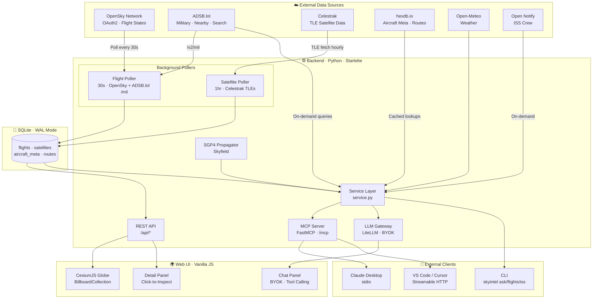

# 🔭 Open Sky Intelligence

**Real-time flight, military aircraft, and satellite tracking with AI-powered queries and an immersive 3D globe.**

[](https://pypi.org/project/skyintel/)
[](LICENSE)
[](https://pypi.org/project/skyintel/)


---

## Features

- 🌍 **3D Globe** — CesiumJS-powered immersive dark globe with real-time flight and satellite rendering
- ✈️ **Flight Tracking** — Live commercial, private, and military aircraft via OpenSky Network + ADSB.lol
- ⚔️ **Military Monitoring** — Unfiltered military aircraft feed — unlike commercial trackers that hide these
- 🛰 **Satellite Tracking** — 6 categories (Space Stations, Military, Weather, Nav, Science, Starlink) via Celestrak + SGP4
- 🚀 **ISS Tracking** — Real-time position, crew info, pass predictions, and one-click Track ISS
- 🌤 **Weather** — Current conditions at any location via Open-Meteo
- 🤖 **MCP Server** — 12 tools via FastMCP, streamable HTTP + stdio for Claude Desktop / VS Code / Cursor
- 💬 **BYOK AI Chat** — Bring your own API key (Claude, OpenAI, Gemini) — keys stored in browser only
- 🖥 **CLI** — Full command suite including `skyintel ask` for terminal-based AI queries
- 📊 **LangFuse Observability** — Optional LLM tracing, token tracking, and latency monitoring

---

## Deployment Branches

SkyIntel ships two branches optimised for different environments:

| | `main` | `railway` |
|---|---|---|
| **Use case** | Self-hosting (home server, VPS, Raspberry Pi) | Cloud demo (Railway, Render, Fly.io) |
| **Flight data** | OpenSky Network + ADSB.lol | ADSB.lol only (33 regional hubs) |
| **Poll strategy** | OpenSky global + ADSB.lol military | Regional `/v2/point` × 33 hubs + `/v2/mil` |
| **Poll interval** | 30s | 60s |
| **Coverage** | Global (OpenSky provides worldwide states) | ~10,000 flights across 33 major hubs worldwide |
| **Military** | ADSB.lol `/v2/mil` | ADSB.lol `/v2/mil` (same) |
| **Satellites/ISS** | ✅ Same | ✅ Same |
| **AI Chat** | ✅ Same (ADSB.lol live queries) | ✅ Same (ADSB.lol live queries) |

### Why two branches?

**OpenSky Network blocks cloud/datacenter IPs** — their API only responds to residential IPs, making it unusable on Railway, Render, and similar platforms. Rather than degrading the main experience, the `railway` branch replaces OpenSky with **parallel regional polling** of 33 major air-traffic hubs via ADSB.lol's `/v2/point/{lat}/{lon}/99999` endpoint (~100 km radius each).

### Hub coverage

The 33 hubs span **7 regions** — North America (8), Europe (8), Middle East (4), Asia (6), Australia/NZ (2), South America (3), and Africa (2) — selected for commercial volume, military significance, and geographic spread. Despite the per-hub radius limit, this typically captures **10,000+ flights** per poll cycle.

### Which should I use?

- **Running locally or on a VPS with a residential IP?** → Use `main`
- **Deploying to a cloud platform?** → Use `railway`

---

## Architecture Overview



---

## Architectural Decisions

| Decision | Choice | Why |
|----------|--------|-----|
| **Dual-source data architecture** | Globe reads from SQLite (polled), Chat/MCP queries ADSB.lol live | Isolates polling from on-demand queries — avoids API rate limit contention, eliminates single point of failure, ensures globe rendering never competes with user queries |
| **BillboardCollection over Entity API** | CesiumJS BillboardCollection + LabelCollection | Entity API crashes at 25k+ objects. BillboardCollection handles 10k+ aircraft smoothly with canvas-based icon caching |
| **SQLite with WAL mode** | Single-file DB at `~/.skyintel/skyintel.db` | Zero-config, no external dependencies, WAL enables concurrent reads during writes. Sufficient for single-instance tracking workloads |
| **SGP4 propagation over external APIs** | Skyfield + sgp4 for satellite/ISS positions | Eliminates external API dependency for position data. TLEs refresh hourly from Celestrak, positions computed locally in real-time with sub-km accuracy |
| **Tool-calling loop with result capping** | Default 50 results per tool, `total_count` always returned | Prevents context window blowout (200k token limit) while giving the LLM accurate counts for reporting |
| **Chat history windowing** | Last 6 messages sent to LLM per request | Reduces input tokens per round-trip. Full history stays visible in UI. Clear chat for best results on complex queries |
| **Retry with exponential backoff** | 3 attempts, 30s/60s waits on rate limit errors | Gracefully handles per-minute token limits on free/low-tier LLM plans instead of failing with raw errors |
| **BYOK security model** | API keys in browser localStorage only | Keys never touch the server — sent per-request via POST body, never logged, never persisted server-side |
| **Vanilla JS, no build step** | Pure JS + CesiumJS CDN | Zero frontend toolchain complexity. No npm, no webpack, no transpilation. Deploy by copying files |
| **FastMCP dual transport** | Streamable HTTP (`/mcp`) + stdio mode | HTTP for remote/web clients (VS Code, Cursor), stdio for local desktop clients (Claude Desktop) |
| **LiteLLM as LLM gateway** | Unified API for Claude, OpenAI, Gemini | Single tool-calling implementation supports all major providers via provider prefixes |
| **LangFuse OTEL integration** | Optional observability via LiteLLM callbacks | Zero-code tracing of every LLM call, tool invocation, token usage, and latency. Opt-in via env vars |

---

## Data Sources

| Source | Used For | Auth | Polling | Notes |
|--------|----------|------|---------|-------|
| **OpenSky Network** | Primary flight data for globe | OAuth2 (required) | Every 30s | Basic auth deprecated March 2026. May block cloud IPs |
| **ADSB.lol** | On-demand flight queries (nearby, search, military) | None | On-demand | `/v2/all` is dead (404). Military endpoint is a key differentiator |
| **Celestrak** | Satellite TLE orbital data | None | Hourly | 6 categories: stations, military, weather, gnss, science, starlink |
| **hexdb.io** | Aircraft metadata + route lookup | None | Cached (30d/7d) | Can go down intermittently. Errors handled gracefully |
| **Open-Meteo** | Weather at any location | None | On-demand | Free, no API key required |
| **Open Notify** | ISS crew information | None | On-demand | Only reliable free source for current ISS crew |

> ⚠️ **Why different data for Globe vs Chat?** This separation is intentional. By isolating the polling source (OpenSky → SQLite → Globe) from the on-demand query source (ADSB.lol → Chat/MCP), we avoid exposing API credentials or rate limits across surfaces, reduce single points of failure, and ensure that high-frequency globe rendering never competes with user-initiated queries for API budget. Flight counts may differ slightly between the globe and chat — this is expected and by design.

---

## Quick Start

```bash
pip install skyintel
```

Create a `.env` file in your project root:

```bash
cp .env.example .env
# Edit .env with your API keys (see Configuration below)
```

Start the server:

```bash
skyintel serve
```

Open [http://localhost:9096](http://localhost:9096) in your browser.

---

## Configuration

All configuration via environment variables with `SKYINTEL_` prefix, or `.env` file:

```env
# Server
SKYINTEL_HOST=0.0.0.0
SKYINTEL_PORT=9096

# OpenSky Network (required for flight polling)
SKYINTEL_OPENSKY_CLIENT_ID=your_client_id
SKYINTEL_OPENSKY_CLIENT_SECRET=your_client_secret

# Cesium Ion (optional — enables terrain layer)
SKYINTEL_CESIUM_ION_TOKEN=your_token

# LLM — for CLI 'ask' command (optional, web chat uses browser localStorage)
SKYINTEL_LLM_PROVIDER=anthropic          # anthropic / openai / google
SKYINTEL_LLM_API_KEY=sk-ant-...
SKYINTEL_LLM_MODEL=claude-sonnet-4-20250514

# LangFuse (optional — LLM observability)
SKYINTEL_LANGFUSE_PUBLIC_KEY=pk-lf-...
SKYINTEL_LANGFUSE_SECRET_KEY=sk-lf-...
SKYINTEL_LANGFUSE_HOST=https://cloud.langfuse.com

# Poll intervals
SKYINTEL_FLIGHT_POLL_INTERVAL=30
SKYINTEL_SATELLITE_POLL_INTERVAL=3600
```

---

## CLI Reference

| Command | Description |
|---------|-------------|
| `skyintel serve` | Start server (MCP + REST + Web UI) |
| `skyintel serve --stdio` | MCP stdio mode for Claude Desktop |
| `skyintel status` | Show config and system status |
| `skyintel init` | Initialise database |
| `skyintel config` | Show current config as JSON |
| `skyintel ask "question"` | Ask the AI a question (uses .env credentials) |
| `skyintel ask "question" --provider anthropic --api-key sk-... --model claude-sonnet-4-20250514` | Ask with explicit credentials |
| `skyintel flights --military` | List military flights |
| `skyintel flights --search RYR123` | Search by callsign/hex |
| `skyintel flights --lat 51 --lon -0.5` | Flights near a point |
| `skyintel satellites --category iss` | List satellites by category |
| `skyintel above --lat 51 --lon -0.5` | Flights + satellites near a point |
| `skyintel iss` | ISS position + crew |
| `skyintel iss --passes --lat 51 --lon -0.5` | ISS pass predictions |
| `skyintel mcp-config` | Print MCP config for Claude Desktop |
| `skyintel mcp-config --vscode` | Print MCP config for VS Code |
| `skyintel mcp-config --stdio` | Print stdio MCP config |

---

## MCP Client Setup

### VS Code + GitHub Copilot ✅ Tested

Add to your `.vscode/mcp.json`:

```json
{
  "servers": {
    "skyintel": {
      "url": "http://localhost:9096/mcp"
    }
  }
}
```

### Claude Code ✅ Tested

```bash
claude mcp add skyintel --transport http http://localhost:9096/mcp
```

### Claude Desktop 🟡 Needs Testing

Add to `~/Library/Application Support/Claude/claude_desktop_config.json`:

```json
{
  "mcpServers": {
    "skyintel": {
      "command": "skyintel",
      "args": ["serve", "--stdio"]
    }
  }
}
```

### Gemini CLI 🔜 Pending

Configuration pending — will be added once Gemini CLI MCP support is verified.

### OpenAI Codex 🔜 Pending

Configuration pending — will be added once Codex MCP support is verified.

---

CLI helper: `skyintel mcp-config`, `skyintel mcp-config --vscode`, or `skyintel mcp-config --stdio`

### Available MCP Tools

| Tool | Description |
|------|-------------|
| `flights_near` | Live flights near a geographic point |
| `search_flight` | Search by callsign or ICAO24 hex |
| `military_flights` | All airborne military aircraft worldwide |
| `flights_to` | Flights heading to a destination airport |
| `flights_from` | Flights departed from an origin airport |
| `aircraft_info` | Aircraft metadata by ICAO24 hex |
| `get_satellites` | Satellite positions by category |
| `get_weather` | Current weather at any location |
| `get_status` | System health and diagnostics |
| `iss_position` | Real-time ISS position |
| `iss_crew` | Current ISS crew members |
| `iss_passes` | ISS pass predictions for a location |

---

## Web UI Guide

- **Globe** — Rotate, zoom, and pan the 3D globe. Flights and satellites render in real-time.
- **Toggle chips** — Enable/disable flight types (Commercial, Military, Private) and satellite categories (Space Stations, Military, Weather, Nav, Science, Starlink).
- **Click to inspect** — Click any flight or satellite for a detail panel with metadata, weather, and route info.
- **Track ISS** — Click the 🛰 Track ISS button in the status bar to rotate the globe to the ISS and open the crew/status panel.
- **Layers** — Switch between Dark, Satellite, Streets, and Terrain (terrain requires free Cesium Ion token).
- **Share** — Snapshot your current view and share via URL or Web Share API.
- **Chat** — Click the 💬 floating button to open the AI chat. Set your API key in ⚙ Settings first.

> **Note:** Terrain view may take time to render.

> 💡 **Tip:** Clear chat history regularly for best performance on complex queries.

---

## API Reference

| Method | Path | Description |
|--------|------|-------------|
| GET | `/` | Web UI |
| GET | `/api/status` | System status + config |
| GET | `/api/flights?lat_min&lat_max&lon_min&lon_max` | Cached flights (bbox) |
| GET | `/api/aircraft/{icao24}` | Aircraft metadata |
| GET | `/api/route/{callsign}` | Flight route |
| GET | `/api/satellites?category=` | Satellite positions |
| GET | `/api/weather?lat=&lon=` | Current weather |
| GET | `/api/iss` | ISS position + crew |
| GET | `/api/iss/passes?lat=&lon=` | ISS pass predictions |
| POST | `/api/chat` | BYOK chat (messages, provider, api_key, model) |
| POST | `/mcp` | MCP streamable HTTP endpoint |

---

## Context Management & Rate Limits

Open Sky Intelligence uses a tool-calling architecture where the LLM makes multiple API calls per query. Each call carries the system prompt, tool definitions, and chat history. We've implemented several strategies to manage token usage:

- **Chat history windowing** — Only the last 6 messages are sent to the LLM per request, reducing input tokens while preserving context. Full history remains visible in the UI.
- **Result capping** — Tool results default to 50 items with `total_count` always returned, preventing context window blowout.
- **Retry with backoff** — Rate limit errors trigger automatic retries (up to 3 attempts, 30s/60s waits).
- **Dual system prompts** — Web chat uses HTML formatting, CLI uses markdown, keeping responses lean per surface.

> 💡 **Tip:** Clear chat history before complex queries for best results. Users on free-tier LLM plans should consider lighter models (e.g. `claude-haiku-4-20250514`, `gpt-4o-mini`).

> ⚠️ These are active areas of improvement. Contributions around smarter context summarisation and token counting are especially welcome.

---

## Roadmap

| Feature | Status |
|---------|--------|
| Flight history playback + time slider | 🔜 Planned |
| Flight pattern recognition + analytics | 🔜 Planned |
| Alert zones + notifications (browser/webhook) | 🔜 Planned |
| PostHog analytics | 🔜 Planned |
| Railway deployment guide | 🔜 Planned |
| Gemini CLI MCP support | 🔜 Pending verification |
| OpenAI Codex MCP support | 🔜 Pending verification |
| Chat panel expand/collapse | 🔜 Planned |
| `flights_latest` upsert table (storage optimisation) | 🔜 Planned |

---

## Contributing

Open Sky Intelligence is open source under the Apache 2.0 license. We welcome contributions:

- 🐛 **Bug reports** — Open an issue with reproduction steps
- 💡 **Feature requests** — Suggest ideas via GitHub Issues
- 🔧 **Pull requests** — Especially welcome in:
  - Context window optimisation
  - Additional data sources and enrichment
  - UI/UX improvements
  - Test coverage
  - Documentation

### Development Setup

```bash
git clone https://github.com/youruser/skyintel.git
cd skyintel
python -m venv .venv && source .venv/bin/activate
pip install -e ".[dev]"
cp .env.example .env  # Add your API keys
skyintel serve
```

---

## Support the Project

If you find Open Sky Intelligence useful, consider supporting its development:

[](https://buymeacoffee.com/0xchamin)

⭐ **Star this repo** if you find it useful — it helps others discover the project.

---

## Enterprise

Need a managed deployment, custom integrations, SLA support, or additional data sources?

📧 **Let's talk** — reach out via [GitHub Issues](https://github.com/youruser/skyintel/issues) or [Buy Me a Coffee](https://buymeacoffee.com/0xchamin) to start a conversation.

---

## Disclaimer

- Flight and satellite data is provided as-is from third-party sources (OpenSky Network, ADSB.lol, Celestrak, hexdb.io). Accuracy, completeness, and availability are not guaranteed.
- Military aircraft data is sourced from publicly available ADS-B signals. Not all military aircraft broadcast ADS-B.
- ISS crew data is sourced from Open Notify and may not reflect real-time crew changes.
- LLM-generated reports and analyses are AI-assisted and should not be used as sole sources for operational, safety, or security decisions.
- BYOK API keys are stored in browser localStorage only — never persisted server-side. Users are responsible for their own API key security.

---

## Coming Soon — Open Nav Intelligence

SkyIntel is evolving into **Open Nav Intelligence** — a unified real-time tracking platform spanning air, sea, and space.

```bash
pip install opennav
```

- 🌊 **Vessel Tracking** — AIS-powered ship monitoring worldwide
- 🛥️ **Submarine Detection** — Deep-sea intelligence layer
- ✈️ **Flight Tracking** — Everything SkyIntel does today
- 🛰️ **Satellite Tracking** — Full orbital awareness
- 🤖 **AI-Powered Queries** — Multi-domain natural language intelligence

Stay tuned.

---

## Disclaimer

Open Sky Intelligence is an **educational project and technical demonstration** showcasing real-time data integration, [Model Context Protocol (MCP)](https://modelcontextprotocol.io/) tool-calling patterns, and AI-powered geospatial intelligence.

All data is sourced from **publicly available open APIs** — no classified, proprietary, or restricted data is used. Flight positions come from [ADSB.lol](https://adsb.lol) and [OpenSky Network](https://opensky-network.org), satellite TLEs from [Celestrak](https://celestrak.org), ISS data from [Open Notify](http://open-notify.org), and weather from [Open-Meteo](https://open-meteo.com).

This project is not affiliated with any government, military, or intelligence agency. Aircraft and satellite positions shown are approximate and should **not** be used for navigation, safety-critical decisions, or operational purposes.

---

## License

Apache 2.0 — see [LICENSE](LICENSE) for details.

---

Built with ❤️ by [0xchamin](https://buymeacoffee.com/0xchamin)
